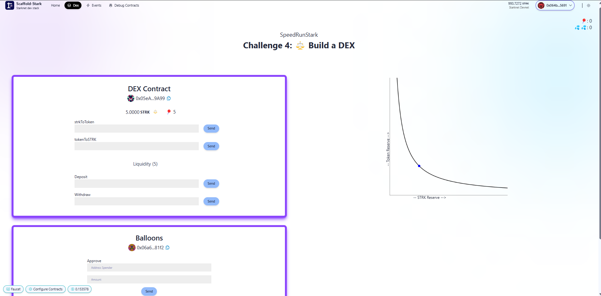
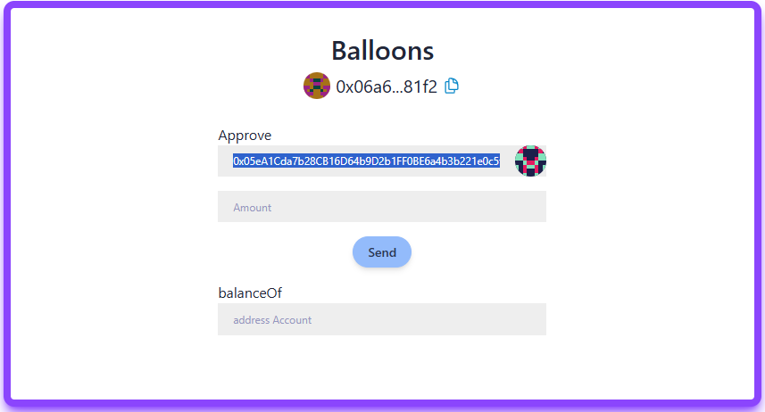
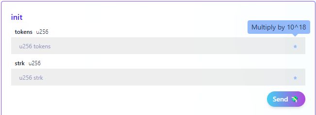
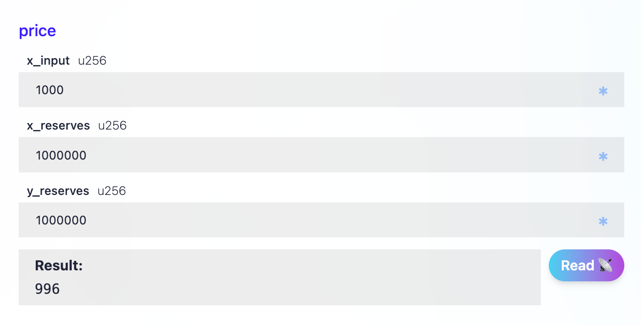
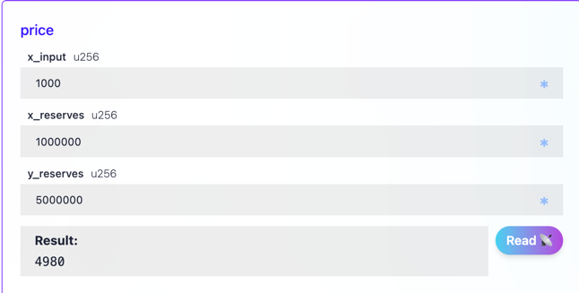
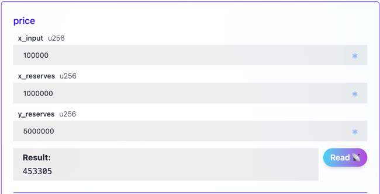

# 🚩 Challenge #4: ⚖️ Build a Dex 🤖


📚 This tutorial is meant for developers that already understand the 🖍️ basics: [Starklings](https://starklings.app/) or [Node Guardians](https://nodeguardians.io/campaigns?f=3%3D2)

This challenge will help you build/understand a simple decentralized exchange, with one token-pair (ERC20 BALLOONS ($BAL) and STRK). This repo is an updated version of the [original tutorial](https://medium.com/@austin_48503/%EF%B8%8F-minimum-viable-exchange-d84f30bd0c90) and challenge repos before it. Please read the intro for a background on what we are building first!

🌟 The final deliverable is an app that allows users to seamlessly trade ERC20 BALLOONS ($BAL) with STRK in a decentralized manner. Users will be able to connect their wallets, view their token balances, and buy or sell their tokens according to a price formula! Deploy your contracts to a testnet then build and upload your app to a public web server. Submit the url on SpeedRunStark.com!

> 💬 Submit this challenge, meet other builders working on this challenge or get help in the [Builders telegram chat](https://t.me/+wO3PtlRAreo4MDI9)!

---

## Checkpoint 0: 📦 Environment 📚

Before you begin, you need to install the following tools:

- [Node (>= v18.17)](https://nodejs.org/en/download/)
- Yarn ([v1](https://classic.yarnpkg.com/en/docs/install/) or [v2+](https://yarnpkg.com/getting-started/install))
- [Git](https://git-scm.com/downloads)
- [Rust](https://www.rust-lang.org/tools/install)
- [asdf](https://asdf-vm.com/guide/getting-started.html)
- [Cairo 1.0 extension for VSCode](https://marketplace.visualstudio.com/items?itemName=starkware.cairo1)

### Starknet-devnet version

To ensure the proper functioning of scaffold-stark, your local `starknet-devnet` version must be `0.4.0`. To accomplish this, first check your local starknet-devnet version:
To ensure the proper functioning of scaffold-stark, your local `starknet-devnet` version must be `0.4.0`. To accomplish this, first check your local starknet-devnet version:

```sh
starknet-devnet --version
```

If your local starknet-devnet version is not `0.4.0`, you need to install it.
If your local starknet-devnet version is not `0.4.0`, you need to install it.

- Install Starknet-devnet `0.4.0` via `asdf` ([instructions](https://github.com/gianalarcon/asdf-starknet-devnet/blob/main/README.md)).
- Install Starknet-devnet `0.4.0` via `asdf` ([instructions](https://github.com/gianalarcon/asdf-starknet-devnet/blob/main/README.md)).

### Compatible versions
- Cairo - v2.11.4
- Rpc - v0.8.0
- Scarb - v2.11.4
- Snforge - v0.41.0
- Starknet-Devnet - v0.4.0

- Cairo - v2.11.4
- Rpc - v0.8.x
- Scarb - v2.11.4
- Snforge - v0.41.0
- Starknet-Devnet - v0.4.0

Make sure you have the compatible versions otherwise refer to [Scaffold-Stark Requirements](https://github.com/Scaffold-Stark/scaffold-stark-2?.tab=readme-ov-file#requirements)

### Docker Option for Environment Setup

<details>

For an alternative to local installations, you can use Docker to set up the environment.
- Install [Docker](https://www.docker.com/get-started/) and [VSCode Dev Containers extension](https://marketplace.visualstudio.com/items?itemName=ms-vscode-remote.remote-containers).
- A pre-configured Docker environment is provided via `devcontainer.json` using the `starknetfoundation/starknet-dev:2.11.4` image.
- A pre-configured Docker environment is provided via `devcontainer.json` using the `starknetfoundation/starknet-dev:2.11.4` image.

For complete instructions on using Docker with the project, check out the [Requirements Optional with Docker section in the README](https://github.com/Scaffold-Stark/scaffold-stark-2?tab=readme-ov-file#requirements-alternative-option-with-docker) for setup details.
</details>

Then download the challenge to your computer and install dependencies by running:

```sh
npx create-stark@latest -e challenge-4-dex challenge-4-dex
cd challenge-4-dex
yarn install
```

or clone from SpeedrunStark repo:

```sh
git clone https://github.com/Scaffold-Stark/speedrunstark.git challenge-4-dex
cd challenge-4-dex
git checkout challenge-4-dex
yarn install
```

> in the same terminal, start your local network (a blockchain emulator in your computer):

```bash
yarn chain
```

> in a second terminal window, 🛰 deploy your contract (locally):

```sh
cd challenge-4-dex
yarn deploy
```

> in a third terminal window, start your 📱 frontend:

```sh
cd challenge-4-dex
yarn start
```

📱 Open <http://localhost:3000> to see the app.

> 👩‍💻 Rerun `yarn deploy` whenever you want to deploy new contracts to the frontend. If you haven't made any contract changes, you can run `yarn deploy:no-reset` for a completely fresh deploy.
><br/>`yarn deploy` always resets contracts. If you don't want it to reset, use yarn `deploy:no-reset`.

---

## Checkpoint 1: 🔭 The Structure 📺

Navigate to the Debug Contracts tab, you should see two smart contracts displayed called DEX and Balloons.

packages/snfoundry/contracts/balloons.cairo is just an example ERC20 contract that mints 1000 $BAL to whatever address deploys it.

packages/snfoundry/contracts/DEX.cairo is what we will build in this challenge and you can see it starts instantiating a token (ERC20 interface) that we set in the constructor (on deploy).
> You can `yarn deploy` to deploy your contract until you get it right.

> Below is what your front-end will look like with no implementation code within your smart contracts yet. The buttons will likely break because there are no functions tied to them yet!


> 🎉 You've made it this far in Scaffold-Stark Challenges 👏🏼 . As things get more complex, it might be good to review the design requirements of the challenge first! Check out the empty DEX.cairo file to see aspects of each function. If you can explain how each function will work with one another, that's great! 😎

> 🚨 🚨 🦈 The Guiding Questions will lead you in the right direction, but try thinking about how you would structure each function before looking at these!

> 🚨 🚨 🦖 The code blobs within the toggles in the Guiding Questions are some examples of what you can use, but try writing the implementation code for the functions first!

---

## Checkpoint 2: Reserves ⚖️

We want to create an automatic market where our contract will hold reserves of both STRK and 🎈 Balloons. These reserves will provide liquidity that allows anyone to swap between the assets. Let's start with declaring our `total_liquidity` and the `liquidity` of each user of our DEX!

<details markdown='1'><summary>🦉 Guiding Questions</summary>

<details markdown='1'><summary>Question One</summary>

> How do we declare a variable that represents an amount of STRK? We don't have to assign it a value just yet.

</details>
<details markdown='1'><summary>Question Two</summary>

> What data structure represents the relation between keys and values (addresses to liquidity or users to STRK)?

</details>

</details>

These variables track the total liquidity, but also the liquidity of each address.
Now, let's create an `init()` function in `DEX.cairo`.
We want this function written in a way that when we send STRK and/or $BAL tokens through our front end or deployer script, the function will get those values from the contract and assign them onto the global variables we just defined.

<details markdown='1'><summary>🦉 Guiding Questions</summary>

<details markdown='1'><summary>Question One</summary>

> How can we check and prevent liquidity being added if the contract already has liquidity?

</details>

<details markdown='1'><summary>Question Two</summary>

> What should the value of `total_liquidity` be, how do we access the balance that our contract has and assign the variable a value?

</details>

<details markdown='1'><summary>Question Three</summary>

> How would we assign our address the liquidity we just provided? How much liquidity have we provided? The `total_liquidity`? Just half? Three quarters?

</details>

<details markdown='1'><summary>Question Four</summary>

> Now we need to take care of the tokens `init()` is receiving. How do we transfer the tokens from the sender (us) to this contract address? How do we make sure the transaction reverts if the sender did not have as many tokens as they wanted to send?

</details>

</details>

Calling `init()` will load our contract up with both STRK and 🎈 Balloons.

We can see that the DEX starts empty. We want to be able to call `init()` to start it off with liquidity, but we don’t have any funds or tokens yet. Add some STRK to your local account using the faucet and then find the `deploy.ts` file. Find and uncomment the lines below and add your front-end address (your burner wallet address).

```
       // todo checkpoint 2: - paste in your front-end address here to get 10 balloons from deployer on deploy
       ...
```

> Run `yarn deploy`.

The front end should show you that you have balloon tokens. We can’t just call `init()` yet because the DEX contract isn’t allowed to transfer ERC20 tokens from our account.

First, we have to call `approve()` on the Balloons contract, approving the DEX contract address to take some amount of tokens.


> 🤓 Copy and paste the DEX address to the _Address Spender_ and then set the amount to 5.
> You can confirm this worked using the `allowance()` function in `Debug Contracts` tab using your local account address as the owner and the DEX contract address as the spender.

Now we are ready to call `init()` on the DEX, using the `Debug Contracts` tab. We will tell it to take 5 of our tokens and send 0.01 STRK with the transaction. Remember in the `Debug Contracts` tab we are calling the functions directly which means we have to convert to fri, so don't forget to multiply those values by 10¹⁸!



In the `DEX` tab, to simplify user interactions, we run the conversion (_tokenAmount_ * 10¹⁸) in the code, so they just have to input the token amount they want to swap or deposit/withdraw.

You can see the DEX contract's value update, and you can check the DEX token balance using the `balance_of` function on the Balloons UI from `DEX` tab.

This works pretty well, but it will be a lot easier if we just call the `init()` function as we deploy the contract. In the `deploy.ts` script try uncommenting the init section, so our DEX will start with 5 STRK and 5 Balloons of liquidity:

```
// todo: checkpoint 2 - uncomment to init DEX on deploy:
// 3. Initialize DEX to pull tokens from deployer
const initResponse = await deployer.execute(
    [{
        contractAddress: dex.address,
        entrypoint: "init",
        calldata: CallData.compile({
            tokens: INITIAL_SUPPLY,  // tokens amount
            strk: INITIAL_SUPPLY // strk amount (0 for now)
        }),
    }],
    {
        maxFee: 1e15,
    }
);
await provider.waitForTransaction(initResponse.transaction_hash);
console.log("DEX Initialization Completed at ", initResponse.transaction_hash);
```

Now, when we `yarn deploy` then our contract should be initialized as soon as it deploys, and we should have equal reserves of STRK and tokens.

### 🥅 Goals / Checks

- [ ] 🎈 In the DEX tab is your contract showing 5 STRK and 5 Balloons of liquidity?
- [ ] ⚠ If you are planning to submit the challenge, make sure to implement the `get_liquidity` getter function in `DEX.cairo`

---
## ⛳️ **Checkpoint 3: Price** 🤑

This section is directly from the [original tutorial](https://medium.com/@austin_48503/%EF%B8%8F-minimum-viable-exchange-d84f30bd0c90) "Price" section. It outlines the general details of the DEX's pricing model.

If you need some more clarity on how the price in a pool is calculated, [this video](https://youtu.be/IL7cRj5vzEU) by Smart Contract Programmer has a more in-depth explanation.

Now that our contract holds reserves of both STRK and tokens, we want to use a simple formula to determine the exchange rate between the two.
Let’s start with the formula `x * y = k` where `x` and `y` are the reserves:

```
(amount of STRK in DEX ) * ( amount of tokens in DEX ) = k
```

The `k` is called an invariant because it doesn’t change during trades. (The `k` only changes as liquidity is added.) If we plot this formula, we’ll get a curve that looks something like:


> 💡 We are just swapping one asset for another, the “price” is basically how much of the resulting output asset you will get if you put in a certain amount of the input asset.

🤔 OH! A market based on a curve like this will always have liquidity, but as the ratio becomes more and more unbalanced, you will get less and less of the less-liquid asset from the same trade amount. Again, if the smart contract has too much STRK and not enough $BAL tokens, the price to swap $BAL tokens to STRK should be more desirable.

When we call `init()` we passed in STRK and $BAL tokens at a ratio of 1:1. As the reserves of one asset changes, the other asset must also change inversely in order to maintain the constant product formula (invariant `k`).

Now, try to edit your `DEX.cairo` smart contract and bring in a price function!

The price function should take in the reserves of `xReserves`, `yReserves`, and `xInput` to calculate the `yOutput`.
Don't forget about trading fees! These fees are important to incentivize liquidity providers. Let's make the trading fee 0.3% and remember that there are no floats or decimals in Cairo, only whole numbers!

We should apply the fee to `xInput`, and store it in a new variable `xInputWithFee`. We want the input value to pay the fee immediately, or else we will accidentally tax our `yOutput` or our DEX's supply `k` 😨 Think about how to apply a 0.3% to our `xInput`.

> 💡 _Hints:_ For more information on calculating the Output Reserve, read the Brief Revisit of Uniswap V2 in [this article](https://hackernoon.com/formulas-of-uniswap-a-deep-dive).

> 💡💡 _More Hints:_ Also, don't forget to think about how to implement the trading fee. Cairo doesn't allow for decimals, so one way that contracts are written to implement percentage is using whole uints (997 and 1000) as numerator and denominator factors, respectively.

<details markdown='1'><summary>🦉 Guided Explanation</summary>

For the math portions of this challenge, you can black-box the math. However, it's still important to understand what the math looks like, but maybe less so how it works or why it works, in other words don't get too caught up in the mathematical details! 😅 Look at articles and videos in this challenge or on your own to find out more if you're curious though! 🤓

1. We are multiplying `xInput` by 997 to "simulate" a multiplication by 0.997 since we can't use decimals in cairo. We'll divide by 1000 later to get the fee back to normal.
2. Next, we'll make our `numerator` by multiplying `xInputWithFee` by `yReserves`.
3. Then our `denominator` will be `xReserves` multiplied by 1000 (to account for the 997 in the numerator) plus `xInputWithFee`.
4. Last, we will return the `numerator` / `denominator` which is our `yOutput`, or the amount of swapped currency. But wait, can we have decimals in Cairo? No, so the output will be rounded up or down to the nearest whole number.

</details>

We use the ratio of the input vs output reserve to calculate the price to swap either asset for the other. Let’s deploy this and poke around:

```
yarn run deploy
```

Let’s say we have 1 million STRK and 1 million tokens, if we put this into our price formula and ask it the price of 1000 STRK it will be an almost 1:1 ratio:



If we put in 1000 STRK, we will receive 996 tokens. If we’re paying a 0.3% fee, it should be 997 if everything was perfect. BUT, there is a tiny bit of slippage as our contract moves away from the original ratio. Let’s dig in more to really understand what is going on here.
Let’s say there is 5 million STRK and only 1 million tokens. Then, we want to put 1000 tokens in. That means we should receive about 5000 STRK:



Finally, let’s say the ratio is the same, but we want to swap 100,000 tokens instead of just 1000. We’ll notice that the amount of slippage is much bigger. Instead of 498,000 back, we will only get 453,305 because we are making such a big dent in the reserves.



❗️ The contract automatically adjusts the price as the ratio of reserves shifts away from the equilibrium. It’s called an 🤖 _Automated Market Maker (AMM)._

### 🥅 Goals / Checks

- [ ] 🤔 Do you understand how the x*y=k price curve actually works? Write down a clear explanation for yourself and derive the formula for price. You might have to shake off some old algebra skills!
- [ ] 💃 You should be able to go through the price section of this tutorial with the sample numbers and generate the same outputChange variable.

---

## Checkpoint 4: Trading 🤝

Let’s edit the `DEX.cairo` smart contract and add two new functions for swapping from each asset to the other, `STRKToToken()` and `tokenToSTRK()`.

The basic overview for `STRKToToken()` is we're going to define our variables to pass into `price()` so we can calculate what the user's `tokenOutput` is.

<details markdown='1'><summary>🦉 Guiding Questions</summary>

<details markdown='1'><summary>Question One</summary>

> How would we make sure the value being swapped for balloons is greater than 0? Also, how do we check if they have enough STRK and have given sufficient allowance to the contract?

</details>

<details markdown='1'><summary>Question Two</summary>

> Is `xReserves` STRK or $BAL tokens? Use a variable name that best describes which one it is. When we call this function, it will already have the value we sent it in it's `liquidity`. How can we make sure we are using the balance of the contract _before_ any STRK was sent to it?

</details>

<details markdown='1'><summary>Question Three</summary>

> For `yReserves` we will also want to create a new more descriptive variable name. How do we find the other asset balance this address has?

</details>

<details markdown='1'><summary>Question Four</summary>

> Now that we have all our arguments, how do we call `price()` and store the returned value in a new variable? What kind of name would best describe this variable?

</details>

<details markdown='1'><summary>Question Five</summary>

> After getting how many tokens the sender should receive, how do we transfer those tokens to the sender?

</details>

<details markdown='1'><summary>Question Six</summary>

> Which event should we emit for this function?

</details>

<details markdown='1'><summary>Question Seven</summary>

> Last, what do we return?

</details>

</details>

😎 Great now onto the next! `tokenToSTRK()` is going to do the opposite so it should be pretty straight forward. But if you get stuck, the guiding questions are always there 🦉

<details markdown='1'><summary>🦉 Guiding Questions</summary>

<details markdown='1'><summary>Question One</summary>

> How would we make sure the value being swapped for STRK is greater than 0? Also, how do we check if the user have enough tokens and the contract has enough allowance?

</details>

<details markdown='1'><summary>Question Two</summary>

> Is `xReserves` STRK or $BAL tokens this time? Use a variable name the describes which one it is.

</details>

<details markdown='1'><summary>Question Three</summary>

> For `yReserves` we will also want to create a new and more descriptive variable name. How do we find the other asset balance this address has?

</details>

<details markdown='1'><summary>Question Four</summary>

> Now that we have all our arguments, how do we call `price()` and store the returned value in a new variable?

</details>

<details markdown='1'><summary>Question Five</summary>

> After getting how much STRK the sender should receive, how do we transfer the STRK to the sender?

</details>

<details markdown='1'><summary>Question Six</summary>

> Which event do we emit for this function?

</details>

<details markdown='1'><summary>Question Seven</summary>

> Lastly, what are we returning?

</details>

</details>

> 💡 Each of these functions should calculate the resulting amount of output asset using our price function that looks at the ratio of the reserves vs the input asset. We can call tokenToSTRK and it will take our tokens and send us STRK or we can call STRKToToken with some STRK in the transaction and it will send us $BAL tokens. Deploy it and try it out!

### 🥅 Goals / Checks

- [ ] Can you trade STRK for Balloons and get the correct amount?
- [ ] Can you trade Balloons for STRK?

> ⚠ When trading Balloons for STRK remember about allowances. Try using `approve()` to approve the contract address for some amount of tokens, then try the trade again!

---

## Checkpoint 5: Liquidity 🌊

So far, only the `init()` function controls liquidity. To make this more decentralized, it would be better if anyone could add to the liquidity pool by sending the DEX both STRK and tokens at the correct ratio.

Let’s create two new functions that let us deposit and withdraw liquidity. How would you write this function out? Try before taking a peak!

> 💬 _Hint:_

> The `deposit()` function receives STRK and also transfers $BAL tokens from the caller to the contract at the right ratio. The contract also tracks the amount of liquidity (how many liquidity provider tokens (LPTs) minted) the depositing address owns vs the total_liquidity.

What does this hint mean in practice? The goal is to allow a user to `deposit()` STRK into our `total_liquidity`, and update their `liquidity`. This is very similar to the `init()` function, except we want it to work for anyone providing liquidity. Also, since there already is liquidity we want the liquidity they provide to leave the ratio of the two assets unchanged.

<details markdown='1'><summary>🦉 Guiding Questions</summary>

Part 1: Getting Reserves 🏦

<details markdown='1'><summary>Question One</summary>

> How do we ensure the sender isn't sending 0 STRK? Also, how do we check if they have enough tokens and have given sufficient allowance to the contract?

</details>

<details markdown='1'><summary>Question Two</summary>

> We need to calculate the ratio of STRK and $BAL after the liquidity provider sends STRK, what variables do we need? It's similar to the previous section. What was that operation we performed on `STRKReserve` in Checkpoint 4 to make sure we were getting the balance _before_ the `STRK sent` went through? We need to do that again for the same reason.

</details>

<details markdown='1'><summary>Question Three</summary>

> What other asset do we need to declare a reserve for, and how do we get its balance in this contract?

</details>

- [ ] Do you have reserves of both assets?

Part 2: Performing Calculations 🤖

> What are we calculating again? Oh yeah, for the amount of STRK the user is depositing, we want them to also deposit a proportional amount of tokens. Let's make a reusable equation where we can swap out a value and get an output of the STRK and $BAL the user will be depositing, named `tokenDeposit` and `liquidityMinted`.

<details markdown='1'><summary>Question Four</summary>

> How do we calculate how many tokens the user needs to deposit? You multiply the value the user sends through by reserves of the units we want as an output. Then we divide by `STRKReserve` and add 1 to the result.

</details>

<details markdown='1'><summary>Question Five</summary>

> Now for `liquidityMinted` use the same equation but replace `tokenReserve` with `total_liquidity`, so that we are multiplying in the numerator by the units we want.

</details>

- [ ] Is `tokenDeposit` assigned the value of our equation?
- [ ] Now is `liquidityMinted` looking similar to `tokenDeposit` but without the `+ 1` at the end?

Part 3: Updating, Transferring, Emitting, and Returning 🎀

<details markdown='1'><summary>Question Six</summary>

> Now that the DEX has more assets, should we update our two global variables? How do we update `liquidity`?

</details>

<details markdown='1'><summary>Question Seven</summary>

> How do we update `total_liquidity`?

</details>

<details markdown='1'><summary>Question Eight</summary>

> The user already deposited their STRK, but they still have to deposit their tokens. How do we require a token transfer from them?

</details>

<details markdown='1'><summary>Question Nine</summary>

> We just completed something important, which event should we emit?

</details>

<details markdown='1'><summary>Question Ten</summary>

> What do we return?

</details>

</details>

> 💡 **Remember**: Every time you perform actions with your $BAL tokens (deposit, exchange), you'll need to call `approve()` from the `balloons.cairo` contract **to authorize the DEX address to handle a specific number of your $BAL tokens**. To keep things simple, you can just do that from `Debug Contracts` tab, **ensure you approve a large enough quantity of tokens to not face allowance problems (see get_deposit_token_amount() to approve BALtokens)**.

> 💬💬 _More Hints:_ The `withdraw()` function lets a user take his Liquidity Provider Tokens out, withdrawing both STRK and $BAL tokens out at the correct ratio. The actual amount of STRK and tokens a liquidity provider withdraws could be higher than what they deposited because of the 0.3% fees collected from each trade. It also could be lower depending on the price fluctuations of $BAL to STRK and vice versa (from token swaps taking place using your AMM!). The 0.3% fee incentivizes third parties to provide liquidity, but they must be cautious of [Impermanent Loss (IL)](https://www.youtube.com/watch?v=8XJ1MSTEuU0&t=2s&ab_channel=Finematics).

<details markdown='1'><summary>🦉 Guiding Questions</summary>

Part 1: Getting Reserves 🏦

<details markdown='1'><summary>Question One</summary>

> How can we verify that a user is withdrawing an `amount` of `liquidity` that they actually have?

</details>

<details markdown='1'><summary>Question Two</summary>

> Just like the `deposit()` function we need both assets. How much STRK does our DEX have? Remember, this function is not payable, so we don't have to subtract anything.

</details>

<details markdown='1'><summary>Question Three</summary>

> What is the value of `tokenReserve`?

</details>

Part 2: Performing Calculations 🤖

> We need to calculate how much of each asset our user is going withdraw, call them `strkWithdrawn` and `tokenAmount`. The equation is: `amount *` reserveOfDesiredUnits `/ total_liquidity`

<details markdown='1'><summary>Question Four</summary>

> How do we get `strkWithdrawn`?

</details>

<details markdown='1'><summary>Question Five</summary>

> How do we get `tokenOutput`?

</details>

Part 3: Updating, Transferring, Emitting, and Returning 🎀

<details markdown='1'><summary>Question Six</summary>

> The user is withdrawing, how do we represent this decrease in this individual's `liquidity`?

</details>

<details markdown='1'><summary>Question Seven</summary>

> The DEX also lost liquidity, how should we update `total_liquidity`?

</details>

<details markdown='1'><summary>Question Eight</summary>

> How do pay the user the value of `strkWithdrawn`?

</details>

<details markdown='1'><summary>Question Nine</summary>

> How do we give them their tokens?

</details>

<details markdown='1'><summary>Question Ten</summary>

> We have an event to emit, which one?

</details>

<details markdown='1'><summary>Question Eleven</summary>

> Last, what are we returning?

</details>

 </details>

🚨 Take a second to understand what these functions are doing if you pasted them into your `DEX.cairo` file in packages/snfoundry/contracts:

### 🥅 Goals / Checks

- [ ] 💧 Deposit liquidity, and then check your liquidity amount through the mapping in the debug tab. Has it changed properly? Did the right amount of assets get deposited?

- [ ] 🧐 What happens if you `deposit()` at the beginning of the deployed contract, then another user starts swapping out for most of the balloons, and then you try to withdraw your position as a liquidity provider? Answer: you should get the amount of liquidity proportional to the ratio of assets within the isolated liquidity pool. It will not be 1:1.
---
## Checkpoint 6: UI 🖼

Cool beans! Your front-end should be showing something like this now!


Now, a user can just enter the amount of STRK or tokens they want to swap and the chart will display how the price is calculated. The user can also visualize how larger swaps result in more slippage and less output asset.

### ⚔️ Side Quests

- [ ] In `packages/nextjs/app/events/page.tsx` implement an event and emit for the `approve()` function to make it clear when it has been executed.

### ⚠️ Test it!

- Now is a good time to run `yarn test` to run the automated testing function. It will test that you hit the core checkpoints. You are looking for all green checkmarks and passing tests!

---

## Checkpoint 7: 💾 Deploy your contracts! 🛰

📡 Find the `packages/nextjs/scaffold.config.ts` file and change the `targetNetworks` to `[chains.sepolia]`.


🔐 Prepare your environment variables.

> Find the `packages/snfoundry/.env` file and fill the env variables related to Sepolia testnet with your own wallet account address and private key.

⛽️ You will need to get some `STRK` Sepolia tokens to deploy your contract to Sepolia testnet.

🚀 Run `yarn deploy --network [network]` to deploy your smart contract to a public network (mainnet or sepolia).

> 💬 Hint: you input `yarn deploy --network sepolia`.

> 💬 Hint: For faster loading of your _"Events"_ page, consider updating the `fromBlock` passed to `useScaffoldEventHistory` in [`packages/nextjs/app/events/page.tsx`](https://github.com/Scaffold-Stark/speedrunstark/blob/challenge-2-token-vendor/packages/nextjs/app/events/page.tsx) to `blocknumber - 10` at which your contract was deployed. Example: `fromBlock: 3750241n` (where `n` represents its a [BigInt](https://developer.mozilla.org/en-US/docs/Web/JavaScript/Reference/Global_Objects/BigInt)). To find this blocknumber, search your contract's address on Starkscan and find the `Contract Creation` transaction line.

---

## Checkpoint 8: 🚢 Ship your frontend! 🚁

> 🦊 Since we have deployed to a public testnet, you will now need to connect using a wallet you own(Argent X or Braavos).

💻 View your frontend at <http://localhost:3000/stakerUI> and verify you see the correct network.

📡 When you are ready to ship the frontend app...

📦 Run `yarn vercel` to package up your frontend and deploy.

> Follow the steps to deploy to Vercel. Once you log in (email, github, etc), the default options should work. It'll give you a public URL.

> If you want to redeploy to the same production URL you can run `yarn vercel --prod`. If you omit the `--prod` flag it will deploy it to a preview/test URL.

---

## Checkpoint 9: 💪 Flex!

👩‍❤️‍👨 Send some $BAL and share your public url with a friend and ask them to swap their tokens :)

--- 

#### Configuration of Third-Party Services for Production-Grade Apps

By default, 🏗 Scaffold-Stark provides predefined Open API endpoint for some services such as Blast. This allows you to begin developing and testing your applications more easily, avoiding the need to register for these services.
This is great to complete your **SpeedRunStark**.

For production-grade applications, it's recommended to obtain your own API keys (to prevent rate limiting issues). You can configure these at:

🔷 `RPC_URL_SEPOLIA` variable in `packages/snfoundry/.env` and `packages/nextjs/.env.local`. You can create API keys from the [Alchemy dashboard](https://dashboard.alchemy.com/).

> 💬 Hint: It's recommended to store env's for nextjs in Vercel/system env config for live apps and use .env.local for local testing.

---

> 🏃 Head to your next challenge [here](https://github.com/Scaffold-Stark/speedrunstark/tree/challenge-4-dex).
>
> � Problems, questions, comments on the stack? Post them to the [🏗 Scaffold-Stark developers chat](https://t.me/+wO3PtlRAreo4MDI9)
